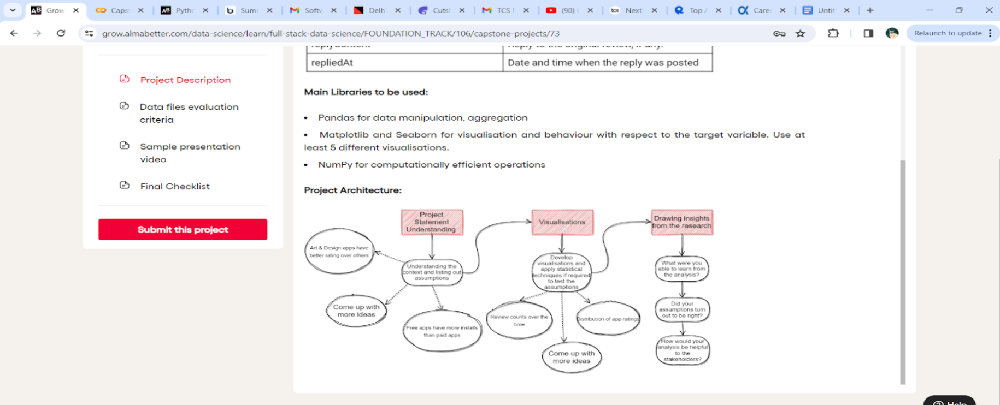

<H1>Play Store Apps</H1>
<h2>Overview</h2>

So basically this was an IIT Gawahati problem statement in which I had to analyse the customer reviews about the app.

<h3>Problem Statement:</h3>

The Play Store apps data has enormous potential to drive app-making businesses to success. 
  Actionable insights can be drawn for developers to work on and capture the Android market. Each app (row) has 
  values for category, rating, size, and more. Another dataset contains customer reviews of the android apps. 
  Explore and analyse the data to discover key factors responsible for app engagement and success.

